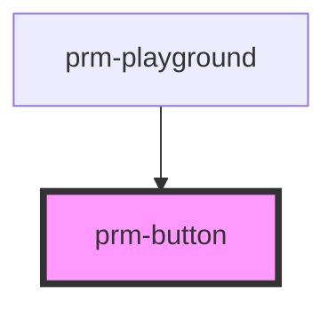

# prm-button

<!-- Auto Generated Below -->

## Properties

| Property      | Attribute     | Description | Type                                                                                            | Default     |
| ------------- | ------------- | ----------- | ----------------------------------------------------------------------------------------------- | ----------- |
| `customclass` | `customclass` |             | `string`                                                                                        | `''`        |
| `disabled`    | `disabled`    |             | `boolean`                                                                                       | `false`     |
| `loading`     | `loading`     |             | `string`                                                                                        | `''`        |
| `name`        | `name`        |             | `string`                                                                                        | `''`        |
| `outline`     | `outline`     |             | `boolean`                                                                                       | `false`     |
| `round`       | `round`       |             | `"full" \| "lg" \| "md" \| "none" \| "sm" \| "xl"`                                              | `'none'`    |
| `size`        | `size`        |             | `"lg" \| "md" \| "sm" \| "xl" \| "xs"`                                                          | `'md'`      |
| `variant`     | `variant`     |             | `"danger" \| "dark" \| "info" \| "light" \| "primary" \| "secondary" \| "success" \| "warning"` | `'primary'` |

## Events

| Event     | Description | Type                      |
| --------- | ----------- | ------------------------- |
| `onclick` |             | `CustomEvent<MouseEvent>` |

## Dependencies

### Used by

 - [prm-playground](../playground)

### Graph

----------------------------------------------

*Built with [StencilJS](https://stenciljs.com/)*
