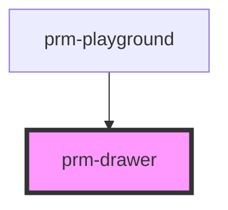

# prm-drawer

<!-- Auto Generated Below -->

## Properties

| Property    | Attribute   | Description | Type                                                                                            | Default     |
| ----------- | ----------- | ----------- | ----------------------------------------------------------------------------------------------- | ----------- |
| `animation` | `animation` |             | `"fade" \| "scale" \| "slide-bottom" \| "slide-left" \| "slide-right" \| "slide-top"`           | `'fade'`    |
| `variant`   | `variant`   |             | `"danger" \| "dark" \| "info" \| "light" \| "primary" \| "secondary" \| "success" \| "warning"` | `'primary'` |

## Events

| Event   | Description | Type                |
| ------- | ----------- | ------------------- |
| `close` |             | `CustomEvent<void>` |

## Dependencies

### Used by

 - [prm-playground](../playground)

### Graph

----------------------------------------------

*Built with [StencilJS](https://stenciljs.com/)*
