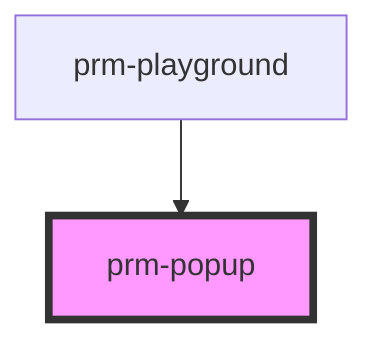

# prm-popup

<!-- Auto Generated Below -->

## Properties

| Property    | Attribute   | Description | Type                                                                                  | Default  |
| ----------- | ----------- | ----------- | ------------------------------------------------------------------------------------- | -------- |
| `animation` | `animation` |             | `"fade" \| "scale" \| "slide-bottom" \| "slide-left" \| "slide-right" \| "slide-top"` | `'fade'` |
| `isOpen`    | `is-open`   |             | `boolean`                                                                             | `false`  |
| `size`      | `size`      |             | `"full" \| "lg" \| "md" \| "sm" \| "xl"`                                              | `'md'`   |

## Dependencies

### Used by

 - [prm-playground](../playground)

### Graph

----------------------------------------------

*Built with [StencilJS](https://stenciljs.com/)*
