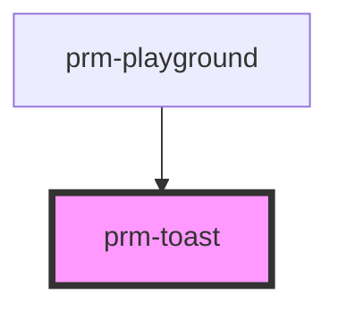

# prm-toast

<!-- Auto Generated Below -->

## Properties

| Property    | Attribute   | Description | Type                                                                                            | Default       |
| ----------- | ----------- | ----------- | ----------------------------------------------------------------------------------------------- | ------------- |
| `animation` | `animation` |             | `"fade" \| "scale" \| "slide-bottom" \| "slide-left" \| "slide-right" \| "slide-top"`           | `'fade'`      |
| `closable`  | `closable`  |             | `boolean`                                                                                       | `true`        |
| `message`   | `message`   |             | `string`                                                                                        | `undefined`   |
| `position`  | `position`  |             | `"bottom-left" \| "bottom-right" \| "top-left" \| "top-right"`                                  | `'top-right'` |
| `show`      | `show`      |             | `boolean`                                                                                       | `false`       |
| `size`      | `size`      |             | `"lg" \| "md" \| "sm" \| "xl" \| "xs"`                                                          | `'md'`        |
| `timer`     | `timer`     |             | `number`                                                                                        | `3000`        |
| `variant`   | `variant`   |             | `"danger" \| "dark" \| "info" \| "light" \| "primary" \| "secondary" \| "success" \| "warning"` | `'primary'`   |

## Events

| Event   | Description | Type                |
| ------- | ----------- | ------------------- |
| `close` |             | `CustomEvent<void>` |

## Dependencies

### Used by

 - [prm-playground](../playground)

### Graph

----------------------------------------------

*Built with [StencilJS](https://stenciljs.com/)*
