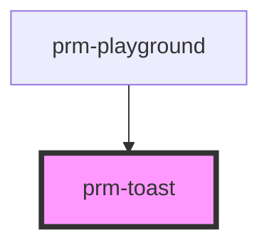

# prm-toast

<!-- Auto Generated Below -->

## Properties

| Property    | Attribute   | Description | Type                                                                                                          | Default       |
| ----------- | ----------- | ----------- | ------------------------------------------------------------------------------------------------------------- | ------------- |
| `animation` | `animation` |             | `"fade" \| "scale" \| "slide-bottom" \| "slide-left" \| "slide-right" \| "slide-top"`                         | `'fade'`      |
| `duration`  | `duration`  |             | `number`                                                                                                      | `5000`        |
| `message`   | `message`   |             | `string`                                                                                                      | `''`          |
| `position`  | `position`  |             | `"bottom-center" \| "bottom-left" \| "bottom-right" \| "center" \| "top-center" \| "top-left" \| "top-right"` | `'top-right'` |
| `show`      | `show`      |             | `boolean`                                                                                                     | `false`       |
| `size`      | `size`      |             | `"lg" \| "md" \| "sm" \| "xl" \| "xs"`                                                                        | `'md'`        |
| `variant`   | `variant`   |             | `"danger" \| "dark" \| "info" \| "light" \| "primary" \| "secondary" \| "success" \| "warning"`               | `'primary'`   |

## Dependencies

### Used by

 - [prm-playground](../playground)

### Graph

----------------------------------------------

*Built with [StencilJS](https://stenciljs.com/)*
